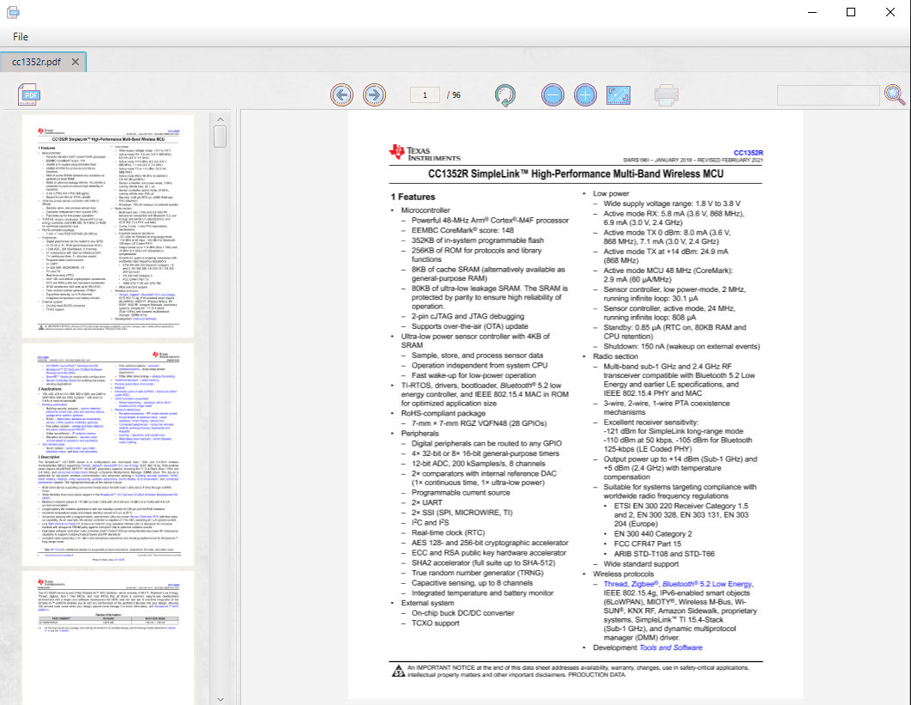

# jFxPDF

jFxPDF is a start up application viewing PDF files using Apache PDFBox library that is an open source Java tool for working with PDF documents.

PDFBox is a project of the Apache Software Foundation.

## Build
You need Java 8 (or higher) 

## Screenshots
